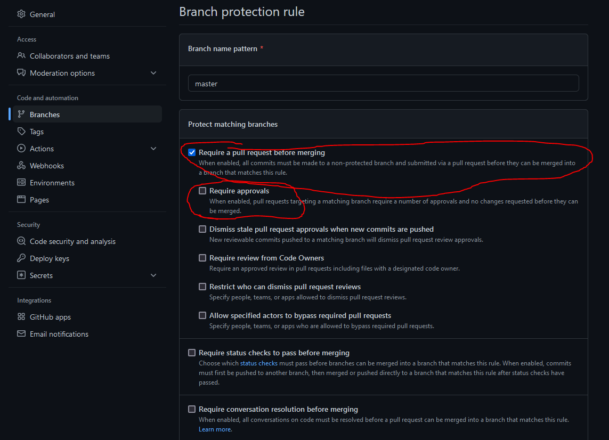
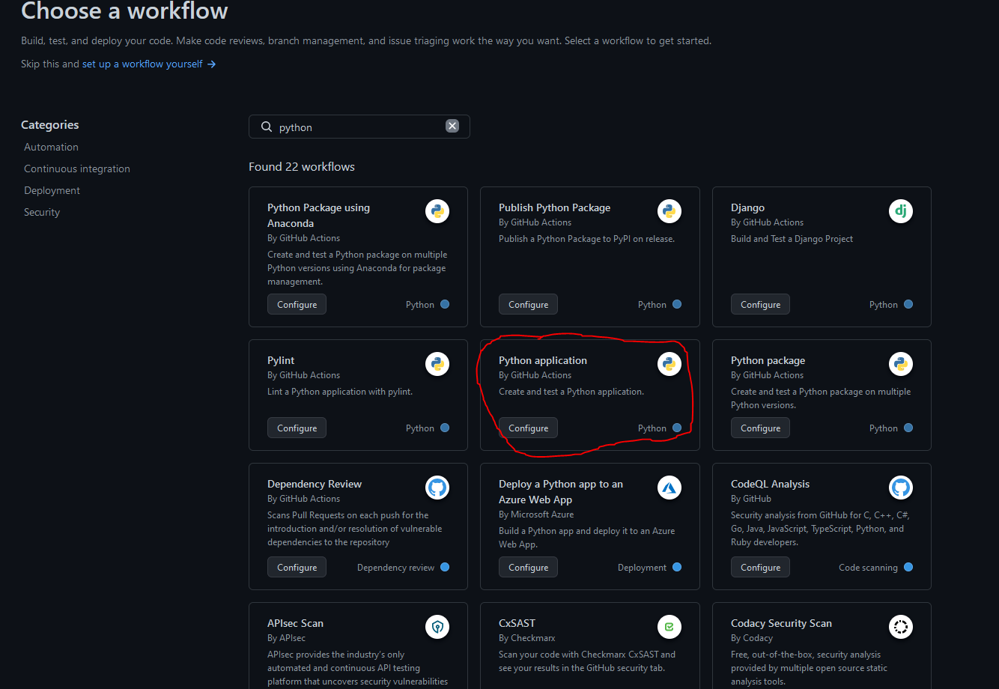

# Automate tests

Now we have our tests set up, we can make github run them whenever certain actions occur. A popular way to set this up is to run the tests whenever a pull request is made - that way you can see if that request breaks your code or not.

For this to be effective, it's a good idea to stop people pushing directly to the main branch (actually, this is probably a good idea in general.) This means that whenever changes are made, they are first pushed to a different branch, then the tests will be automatically run, and - if they pass - you can except the pull request. 

## Set up main branch protection

In github, make the following changes:

- Go settings, branches, branch protection, and add new rule
  - **hint:** your 'main' branch could be called "main" or "master", you have to check and update "branch name pattern" accordingly


- check 'Require a pull request....'
- uncheck "require approvals"
- If you scroll down further, there is another box "Include administrators" - check that one too



## Locally: switch to a new branch

If you are currently on the 'main' branch on your local machine, this would be a good time to switch since in the future you won't be able to push from that branch anyway. So make a new branch called e.g. "development" and switch to it.

## set up automatic tests

- from github.com, click "actions" "new workflow":


- search for python and choose 'python application' - this is a basic workflow that by default will checkout our main branch and run some tests on it. 



- When you click configure, you will be taken to a yml file. you can have a read through this if you want, but for this tutorial replace it with the below:

```yaml
# run pytest

name: tests

on:
  push:
    branches: [ master ]
  pull_request:
    branches: [ master ]

permissions:
  contents: read

jobs:
  build:

    runs-on: ubuntu-latest

    steps:
    - uses: actions/checkout@v3
    - name: Set up Python 3.10
      uses: actions/setup-python@v3
      with:
        python-version: "3.10"
    - name: Install dependencies
      run: |
        python -m pip install --upgrade pip
        pip install -r dev_requirements

    - name: Test with pytest
      run: |
        pytest

```

Compared with the default we have tweaked this a little bit:

- We aren't using pylint, because to be honest it's doubtful my code would pass its very stringent tests!
- I've updated the requirements installation

Click ```start commit``` then ```propose changes```.


Because we banned commits directly to the main branch, this will open a new branch, and make a pull request from this new branch into main. Click ```create pull request```. Note that the tests will now run automatically.

We haven't insisted that the tests pass before merging, but we could if we want.

## Add a workflow badge 

Add the following text to the readme, right next to the 'coverage' badge line:

```markdown

```

This produces a badge on our readme, so now people know that in addition to the fact that we have implemented some tests and have 100% coverage of our code base, they are running automatically - and passing!
