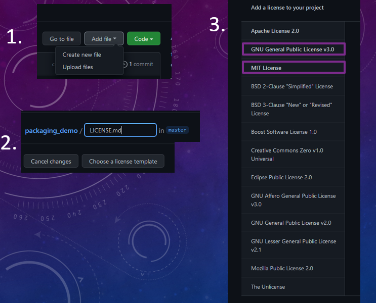

# Setting up a new package

1. Create a new folder somewhere called "DemoPythonProject"
2. Open this folder as a new project in your chosen IDE

## Environment set up

Ideally for any new python project, you would start by creating a fresh virtual environment.

However, the way that you create new environments depends on a lot of different factors so it is difficult for me to give specific instructions. 

## Package creation

Create a new folder called ```MyPackage```

This folder is where we are going to put all our source code. This is what will eventually be built and uploaded to PyPi. The remaining directories we will be creating are purely for support - testing, examples, and documentation.

As some demo code, we are going to use a 'sine_plotter' function. 

1. Create a new python file inside ```MyPackage``` called ```PlotSineWave.py``` and copy the below code into it:

```python
from matplotlib import pyplot as plt
import numpy as np


def sine_wave_plotter(Amplitude=1, Phase=0, Frequency=1, x_min=0, x_max=np.pi*2, n_samples=100):
    """
    this function plots a sine wave with the variables defined below.

    :param Amplitude: Amplitude of sine wave
    :param Phase: phase of sine wave
    :param Frequency: Frequency of sine wave
    :param x_min: start of x data
    :param x_max: end of x data
    :param n_samples: number of samples in x data
    :return: None
    """

    # create_data
    x = np.linspace(x_min, x_max, n_samples)
    y = (Amplitude * np.sin(x*Frequency))

    # plot figure
    plt.figure()
    plt.plot(x, y)
    plt.grid()
    plt.xlabel('x [AU]')
    plt.ylabel('y [AU]')
    plt.show()


```

2. Create a new file called ```__init__.py```' and copy the below code into it

```python
"""
This library allows a user to plot a sine wave. It's fully sick.
"""
__version__ = '0.0.0'
```

> Always have an ```__init__.py``` file in the root of a package. It can be empty if you want, but it should always be there.

## .gitignore

It's better to add a .gitignore to your repository sooner rather than later. [Here's](https://github.com/github/gitignore/blob/main/Python.gitignore) a useful template.

## License

It's also best to choose a license ASAP.

The easiest way to do this is actually from within github;

- click new_file, create new file
- type LICENSE.md
- click 'choose a license template'
- A number of templates will appear.

If you want to learn more about choosing a license, see this site.

For now, let's keep it simple: I recommend one of two license for basically every project: 

- MIT: Basically, anyone can take your code and do whatever they want with it. This is a permissive license.
- GNU GPL 3:People can do almost anything with your code, **except** build it into a closed source project. Changes to the code also have to be released under the same license. This is called [copyleft](https://en.wikipedia.org/wiki/Copyleft). 
  - **Note:** This doesn't preclude commercial use; only the modified parts of the GPL licensed code need to be released, not the entire project.


Once you've chosen your license, github will automatically add it in a new branch. You should create a pull request and pull it into the main branch.




